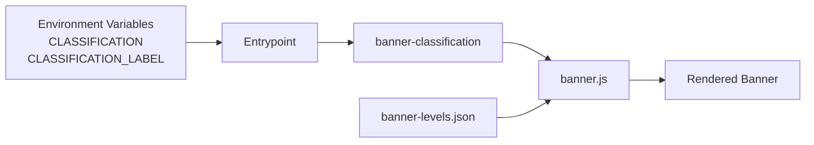
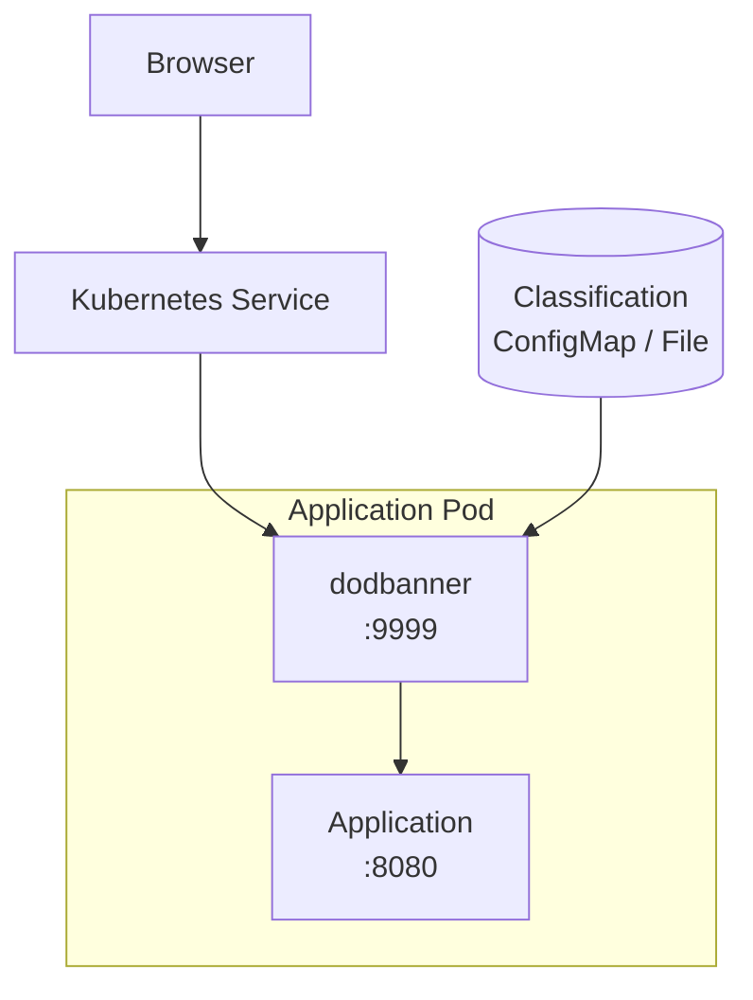

# DoD Classification Banner Injection Proxy

A lightweight, zero-application-modification Nginx reverse proxy that automatically injects standard Department of Defense (DoD) classification banners (top and/or bottom) into the HTML of web applications whose HTML entry points can be safely modified by Nginx sub_filter.

Ideal for air-gapped, classified, or CUI environments where every web UI must display the current classification level without requiring changes to the upstream application.

Important: dodbanner provides a visual classification marking only. It does not enforce access controls, prevent data disclosure, or determine the classification of application data. It must not be used as a security boundary.

| Application | Injection path | CSS/JS | Notes            |
| ----------- | -------------- | ------ | ---------------- |
| Grafana     | `/`, `/login`  | CSS    | Fixed navigation |
| MinIO       | `/`            | CSS    | Console layout   |
| DbGate      | `/login.html`  | JS     | SPA              |
| Kafbat      | SPA routes     | CSS    | API exclusions   |
| pgAdmin     | `/browser`     | CSS    | ...              |
| Nexus       | UI routes      | CSS    | ...              |
| SonarQube   | UI routes      | CSS    | ...              |

---

## Goal

Many DoD and federal systems require a persistent visual classification banner on every page of every web application. Most commercial or open-source tools (Grafana, MinIO, DbGate, Kafka UI, etc.) do not provide this out of the box.

`DoD Banner` solves this by sitting in front of the application as a transparent reverse proxy. It:

- Serves the original application unchanged for all non-HTML requests
- Intercepts the main HTML entry point(s)
- Injects a small amount of JavaScript + CSS that renders the correct classification banner
- Adjusts layout for known applications so the banners do not overlap critical UI elements

The result is a standards-compliant classification banner with almost no operational overhead.

---

## How It Works

1. Nginx listens on a configurable port (default `9999`).
2. All traffic is proxied to the real application (`BACKEND_HOST`:`BACKEND_PORT`).
3. When a request matches the `INJECT_PATH_REGEX` regular expression (the main HTML page / login page / SPA entry point), Nginx uses `sub_filter` to inject a `<script>` and `<link>` into the HTML (by default right before `</head>`).
4. The injected `banner.js` fetches:
   - Current classification + caveats (`banner-classification`)
   - Color/style definitions (`banner-levels.json`)
   - Display options (`banner-options.json`)
5. Banners are rendered as fixed-position elements at the top and/or bottom of the viewport.
6. Optional application-specific CSS/JS (Grafana, DbGate, MinIO, Kafbat, etc.) adjusts padding, headers, and sidebars so content is not obscured.

The proxy is completely transparent to the application. No cookies, no session changes, no backend modifications.



## Response compression

DoD Banner disables upstream HTTP response compression for requests that may be modified because Nginx sub_filter must operate on uncompressed HTML. This is generally insignificant for HTML entry points but may affect large HTML responses.

---

## Quick Start

### Build the image

```bash
docker build -f Dockerfile -t dodbanner:latest .
```

### Run it

```bash
docker run -d \
  --name dodbanner \
  -p 9999:9999 \
  -e BACKEND_HOST=my-app \
  -e BACKEND_PORT=3000 \
  -e LISTEN_PORT=9999 \
  -e INJECT_PATH_REGEX='^/(?:index.html)?$' \
  -e CLASSIFICATION="UNCLASSIFIED" \
  dodbanner:latest
```

Point users at `http://your-host:9999` instead of the original application port.

---

## Environment Variable Configuration

All configuration is done via environment variables (substituted into the Nginx template at container start).

| Variable | Default | Description |
| --------------------- | ---------------------------------- | ------------- |
| `BACKEND_HOST` | `127.0.0.1` | Upstream application hostname or container name |
| `BACKEND_PORT` | `8080` | Upstream application port |
| `LISTEN_PORT` | `9999` | Port the banner proxy listens on |
| `INJECT_PATH_REGEX` | `^/(?:index.html)?$` | **Regex** that matches the HTML page(s) that should receive the banner injection |
| `INJECT_BEFORE` | `</head>` | String that `sub_filter` looks for |
| `INJECT_CSS` | `` | Name of application specific CSS override |
| `INJECT_JS` | `` | Name of application specific JS override |
| `CLASSIFICATION` | `UNAVAILABLE` | Classification Level |
| `CLASSIFICATION_LABEL` | `` | Optional caveat/dissemination control |

### Build-time arguments (Dockerfile)

| ARG                   | Default        | Description |
|-----------------------|----------------|-------------|
| `RUNTIME_IMAGE`       | `quay.io/hummingbird/nginx:latest-builder` | Base image |

---

## Classification & Banner Appearance

### `banner-classification` (plain text)

```text
UNCLASSIFIED
FOUO
```

- First line → classification level (must match a key in `banner-levels.json`)
- Subsequent lines → caveats / dissemination controls (joined with ` // `)

### `banner-levels.json`

Defines colors and display text for each classification:

```json
{
  "levels": {
    "UNCLASSIFIED": {
      "text": "UNCLASSIFIED",
      "backgroundColor": "#007A33",
      "textColor": "#FFFFFF"
    },
    "CUI": {
      "text": "CUI",
      "backgroundColor": "#502B85",
      "textColor": "#FFFFFF"
    },
    "CONFIDENTIAL": { ... },
    "SECRET": { ... },
    "TOPSECRET": { ... }
  }
}
```

### `banner-options.json`

Controls layout and styling:

```json
{
  "showTopBanner": true,
  "showBottomBanner": true,
  "bannerHeight": "28px",
  "fontFamily": "Arial, Helvetica, sans-serif",
  "fontSize": "18px",
  "fontWeight": "bold",
  "zIndex": 99999,
  "application": "",
  "appendApplication": false
}
```

---

## Customizing for a New Application

1. Identify the HTML entry point (usually `/`, `/index.html`, `/login`, etc.).
2. Set `INJECT_PATH_REGEX` to a regex that matches only that page (or pages).
3. Decide where to inject (`</head>` is almost always correct).
4. If the application uses fixed headers/sidebars or `100vh` layouts, create a small CSS or JS helper (copy the pattern from the existing `*-banner.css` / `*-banner.js` files).
5. Mount the helper into `/usr/share/nginx/html/banner/` or rebuild the image.

Example for a generic SPA:

```bash
-e INJECT_PATH_REGEX='^/(?:index\.html)?$'
```

---

## Architecture Notes

- Uses Nginx `sub_filter` (must disable upstream compression with `Accept-Encoding: ""`).
- Banner assets are served from `/banner/` (static files inside the container).
- Runs as non-root user `nginx`.
- Compatible with Red Hat Hummingbird / UBI-based images and standard Alpine/Debian Nginx images (with minor adjustments).

---

## Security Considerations

- Classification is determined solely by the content of `banner-classification`.
The classification configuration is security-sensitive because its integrity must be protected. The classification value itself is not a secret.
- The proxy does **not** enforce classification; it only displays it. Access control remains the responsibility of the upstream application and network controls.
- All banner assets are public within the container; do not place secrets in them.

---

## Development & Extending

```text
banners/
├── banner.js              # Core banner renderer
├── banner.css             # Shared styles
├── banner-levels.json     # Classification → colors
├── banner-options.json    # Display options
├── banner-classification  # Current level + caveats
├── *-banner.css / .js     # Application-specific layout helpers
nginx/
├── banner.conf.template   # Main server block (env-substituted)
├── nginx.conf
└── docker-entrypoint.d/   # Standard Nginx entrypoint scripts
```

To add a new classification color or change the default height, edit the JSON files and rebuild (or mount them at runtime).

---

## Kubernetes Sidecar Pattern

The most common production deployment is to run `dodbanner` as a **sidecar** next to the application container in the same Pod.

- The application container continues to listen on its normal port (e.g. `8080`).
- The `dodbanner` sidecar listens on `9999` and proxies to the application on `localhost`.
- The Kubernetes **Service** points at the sidecar port (`9999`), so all external traffic goes through the banner proxy.



### Example Deployment

```yaml
apiVersion: apps/v1
kind: Deployment
metadata:
  name: my-app
spec:
  replicas: 1
  selector:
    matchLabels:
      app: my-app
  template:
    metadata:
      labels:
        app: my-app
    spec:
      containers:
        # -------------------------------------------------
        # Main application container
        # Health checks still directly hit the container port
        # -------------------------------------------------
        - name: app
          image: my-app:latest
          ports:
            - containerPort: 8080
              name: http

        # -------------------------------------------------
        # DoD Banner Injection sidecar
        # -------------------------------------------------
        - name: dodbanner
          image: dodbanner:latest
          ports:
            - containerPort: 9999
              name: banner
          env:
            - name: BACKEND_PORT
              value: "8080"
            - name: INJECT_PATH_REGEX
              value: "^/(?:index.html)?$"
            - name: INJECT_BEFORE
              value: "</head>"
              # Typically use either custom CSS or JS not both
            - name: INJECT_CSS
              value: appname-banner.css
            - name: INJECT_JS
              value: appname-banner.js
            - name: CLASSIFICATION
              value: SECRET
            - name: CLASSIFICATION_LABEL
              value: NOFORN
          # Optional: resource limits
          resources:
            requests:
              cpu: 50m
              memory: 64Mi
            limits:
              cpu: 200m
              memory: 128Mi
```

### Application-specific examples

#### Grafana

```yaml
- name: BACKEND_PORT
  value: "3000"
- name: INJECT_PATH_REGEX
  value: "^/(?:login)?$"
- name: INJECT_CSS
  value: "grafana-banner.css"
```

### DBGate

```yaml
- name: BACKEND_PORT
  value: "3000"
- name: INJECT_PATH_REGEX
  value: "^/(?:login.html)?$"
- name: INJECT_JS
  value: "dbgate-banner.js"
```

### MinIO

```yaml
- name: BACKEND_PORT
  value: "9001"
- name: INJECT_PATH_REGEX
  value: "^/(?:)$"
- name: INJECT_CSS
  value: "minio-banner.css"
```

### Kafbat / KafkaUI

```yaml
- name: BACKEND_PORT
  value: "8080"
- name: INJECT_PATH_REGEX
  value: "^/(?!api|actuator|static|assets|.*\\.(js|css|png|jpg|svg|ico|woff2?)$).*"
- name: INJECT_CSS
  value: "kafbat-banner.css"
```

### Pgadmin

```yaml
- name: BACKEND_PORT
  value: "80"
- name: INJECT_PATH_REGEX
  value: "^/(?:browser)?/?$"
- name: INJECT_CSS
  value: "pgadmin-banner.css"
```

#### Nexus

```yaml
- name: BACKEND_PORT
  value: "8081"
- name: INJECT_PATH_REGEX
  value: "^/(?!service|repository|v1|static|favicon|.*\\.(js|css|png|jpg|svg|ico|woff2?)$).*"
- name: INJECT_CSS
  value: "nexus-banner.css"
```

#### SonarQube

```yaml
- name: BACKEND_PORT
  value: "9000"
- name: INJECT_PATH_REGEX
  value: "^/(?!api|static|css|js|images|favicon|.*\\.(js|css|png|jpg|svg|ico|woff2?)$).*"
- name: INJECT_CSS
  value: "sonarqube-banner.css"
```

#### Hashicorp Vault

```yaml
- name: BACKEND_PORT
  value: "8200"
- name: INJECT_PATH_REGEX
  value: "^/ui/.*$"
- name: INJECT_CSS
  value: "vault-banner.css"
```

#### Mattermost

```yaml
- name: BACKEND_PORT
  value: "8065"
- name: INJECT_PATH_REGEX
  value: "^/(?!api|plugins|static|images|fonts|.*\\.(js|css|png|jpg|jpeg|gif|svg|ico|woff2?|map|json)$).*"
- name: INJECT_CSS
  value: "mattermost-banner.css"
```

#### Keycloak

```yaml
- name: BACKEND_PORT
  value: "8080"
- name: INJECT_PATH_REGEX
  value: "^/(?!.*\\.(js|css|png|jpg|jpeg|gif|svg|ico|woff2?|map|json)$).*"
- name: INJECT_CSS
  value: "keycloak-banner.css"
```
